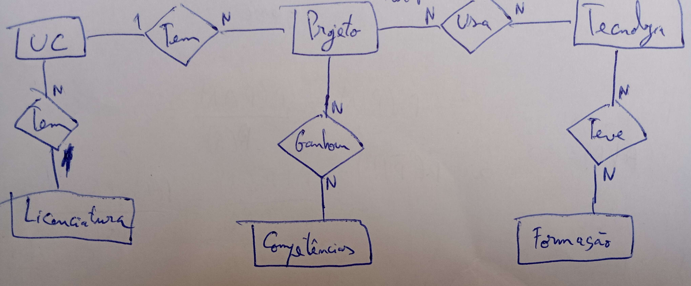
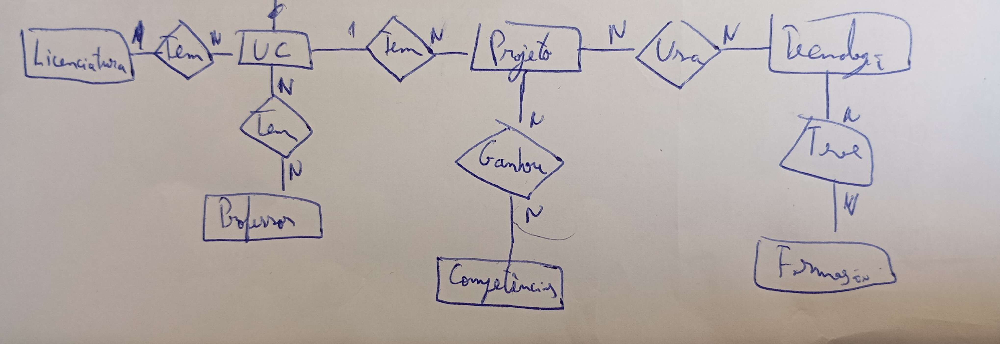

# Making Of

Primeiro comecei por definir as entidades e os seus atributos:

1. UC
    - nome
    - ano
    - semestre
    - professor (relação com a entidade **Professor**)
    - imagem
    - projeto (relação com a entidade **Projeto**)
    - codigo_uc

2. Projeto
    - nome
    - descricao
    - tecnologia (relação com a entidade **Tecnologia**)
    - repositorio
    - conceitos_aplicados
    - uc (relação com a entidade **UC**)

3. Licenciatura
    - nome
    - competencia (relação com a entidade **Competencia**)
    - uc (relação com a entidade **UC**)
    - professor (relação com a entidade **Professor**)

4. Tecnologia
    - nome
    - interesse
    - projeto (relação com a entidade **Projeto**)
    - site
    - descricao

5. TFC
    - nome
    - tecnologia (relação com a entidade **Tecnologia**)
    - descricao
    - email
    - classificacao

6. Competencia
    - nome
    - descricao

7. Formacao
    - nome
    - empresa
    - descricao

8. Making Of:
    - registos_trabalho (imagens)
    - descricao_decisoes
    - erros_encontrados

Depois fiz então o diagrama ER como é possível verificar na imagem:

---

Quando comecei a criar as entidades no Django apercebi-me que havia certos atributos que não faziam sentido existir, ou que estavam mal situados, assim como apercebi-me que poderia acrescentar uma nova entidade.

Professor
- nome
- uc (relação com a entidade **UC**)
- formacao
- email
- site

Esta entidade embora não tenha sido pedida, achei por bem colocar já que a meu ver faz todo sentido incluir. Uma informação que é importante para cada uc é saber que professores lecionam essa unidade curricular. E depois com essa entidade é possível dispor mais informação que poderá ser interessante verificar, como que formação têm.

Na entidade **Projeto** acabei por eliminar o atributo uc, já que a entidade UC é que teria uma ligação a Projeto, ou seja, a UC é que tem um Projeto. Entretanto fiz a entidade Tecnologia que fez a relação N para N com a entidade Projeto. Nesta caso o Projeto é que tem a Tecnologia. Na entidade Tecnologia acabei por acrescentar o atributo **logo**, uma imagem do logotipo da tecnologia. Alterei também o atributo "interesse" para "classificacao". Este atributo é referente ao quão à vontade estou com uma determinada tecnologia. Também é importante referir que alterei a entidade Professor para Docente, tendo achado mais correto.

---

Entretanto fiz a entidade Competencia. Os atributos mantiveram-se à ideia original, porém alterei apenas de "nome" para "tipo", já que a meu ver, faz mais sentido ser um tipo de competência e não um nome de uma competência. Acrescentei então à entidade Projeto uma ligação à entidade Competencia, já que foi graças aos projetos que fui realizando que adquiri certas competências.

---

No admin.py acabei por acrescentar à list_display do DocenteAdmin o email e o site, já que achei que ficava melhor do que só o nome do docente. Ao ProjetoAdmin adicionei o atributo "repositorio", pois acho que faz todo o sentido dispor o site do repositório do projeto caso exista. Em TecnologiaAdmin acrescentei o "site_oficial" e em UCAdmin o "ano" e o "semestre", pois senti que faltavam atributos.

---

Na entidade Docente alterei o atributo "email" de CharField() para EmailField(), pois lembrei-me que na ficha anterior de Django tinha usado o EmailField(), sendo este mais correto para este campo.
Fiz também a entidade Formacao. Tendo esta sofrido algumas alterações. Alterei de "nome" para "tipo", já que nem todas as formações têm propriamente um nome, e tirei o atributo "empresa" já que nem todas as formações são feitas através de empresas. Com isto acrescentei o atributo "data" para ter a informação de quando se fez a formação. Por fim adicionei uma ligação à entidade Formacao na entidade Tecnologia, já que podem existir formações de tecnologias.

---

Fiz a entidade MakingOf. Esta ficou diferente do plano original. Alterei de "registos_trabalho" para "fotos", acrescentei "alteracao" e "justificacao" para poder ter campos mais específicos e prórpios para cada tipo diferente de informação, de forma a estar mais organizado. Ainda adicionei um campo "Llm" para caso tenha sido um LLM, dizer que auxílio prestou e se ajudou ou não.

---

Fiz a entidade Tfc. Para esta tive primeiro que verificar o meu ficheiro `.json` da ficha 4. Esta consistia em fazer webscrapping para um ficheiro `.json` com toda a informação dos TFCs. Fui ver então que atibutos lá tinha, e passei exatamente os mesmos para a entidade Tfc.

Atributos:
- titulo
- aluno
- orientador
- licenciatura
- pdf
- mail
- resumo
- palavras_chave
- tecnologias
- rating

Para além disso ainda fiz uma pequena alteração. Em todas as entidades que tinham o atributo "descricao", mudei de CharField() para TextField(), já que é mais correto para quando queremos escrever mais e não sabemos ao certo o tamanho do texto, sendo mais seguro que colocar um limite de caracteres específico.

---

Fiz o carregamento de dados dos TFCs. Para isso fiz o loader_tfc.py seguindo as intruções dadas pelo professor no vídeo que foi disponibilizado. Tedo criado a pasta `data/` para colocar o ficheiro `tfc.json` que contém toda a informação dos TFCs.

---

Para carregar os dados para a entidade UC acabei por adicionar novos atributos, usando o script dado pelo professor que utiliza uma API para ir buscar informação sobre as ucs. Analisei os ficheiros `.json` criados pelo script e escolhi alguns atributos que achei importante adicionar à minha entidade UC. Achei por bem escolher os atributos "ects", "objetivo", "programa" e "avaliacao", já que são informações relevantes para as ucs. O resto da informação que existia no `.json` também era interessante, porém na minha opinião, estes atributos eram os mais relevantes.

---

Fiz o loader_uc.py que é responsável pelo carregamento de dados da entidade UC. Acrescentei à pasta `data/` uma nova pasta chamada `ucs`, onde encontam-se todos os ficheiros `.json` com a informação das ucs gerados pelo script.
Quando rodei o loader_uc.py apercebi-me que havia uma ficheiro em específico que estava a dar erro ao ler. O motivo era porque o último ficheiro `.json` era diferente dos outros. Este tinha informação adicional das ucs, da licenciatura e até dos docentes. O erro era causado por tentar ir buscar campos que não existiam nesse json. Movi esse ficheiro específico então diretamente para a pasta `data/`. Em seguida adaptei o loader_uc.py para utilizar primeiro a informação das ucs desse ficheiro. Primeiro iria buscar o código da uc, e depois ia então buscar o ficheiro correspondente à cadeira com esse código para ter informação mais completa, usando informação do ficheiro com informação geral sobre as ucs e depois o ficheiro correspondente à uc com informação mais específica.

---

Retirei da entidade UC o atributo "avaliacao", já que apercebi-me depois que no ficheiro json esse atributo vinha escrito com código HTML.

---

Em loader_uc.py acrescentei também o carregamento de dados dos docentes. Para isso adicionei mais alguns atributos à entidade Docente, que estavam presentes no json, e que achei que eram os mais relevantes. Adicionei "card_code", "employee_code", "degree" e "regime", já que são as informações mais importantes das que se encontravam no json. Removi no entanto o atributo "site", já que apercebi-me que não tinha grande utilidade, e apenas tinha colocado esse atributo no começo do trabalho, pois tinha em mente que a forma que iríamos buscar estas informações através de algum site da lusófona. Acabou por ser o script que usa uma API, logo o site já não era relevante.

---

Adicionei novas formas de listing, ordering e searching em DocenteAdmin.
Estas alterações consistiram em adicionar "employee_code", "email", "degree" e "regime" a list_display, já que é informação importante e que deveria ser listada para ser mais fácil obter essas informações.
Em ordering adicionei "employee_code" para caso exista nomes repetidos, podermos ordenar também pelo seu número.
E por fim em search_fields adicionei "employee_code" e "email", já que podemos querer pesquisar docentes não só pelo seu nome, mas também pelo seu número ou email.

---

Fiz em loader_uc.py uma forma de carregar dados para a entidade Licenciatura. Para isso adicionei alguns atributos que achei que eram os mais importantes existentes no json. Estes foram "curso_codigo", "semestres", "descricao", "objetivos" e "cursos_ects".

---

Corrigi um erro que tinha. No loader_uc.py tinha colocado no atributo "curso_codigo" os ects.

---

Adicionei blank=True ao atributo "repositorio" da entidade Projeto, pois nem sempre existem repositórios para certos projetos. Assim como no atributo "docente" da entidade UC, pois quando estamos a criar as UCs podemos ainda não ter os professores prontos (criados).
